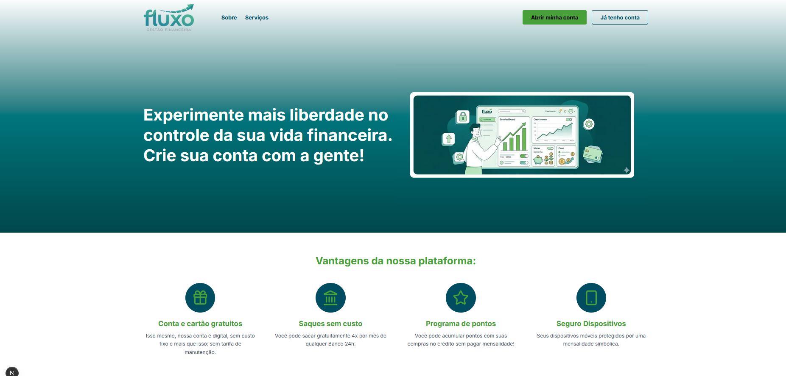
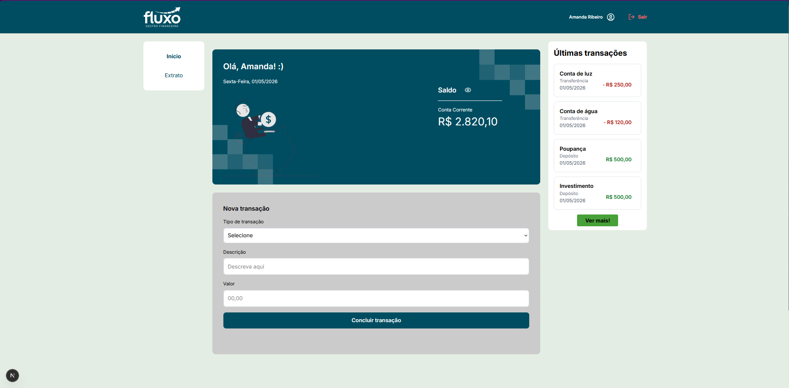
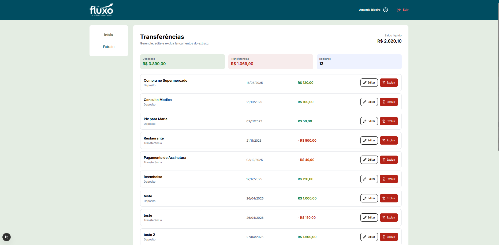
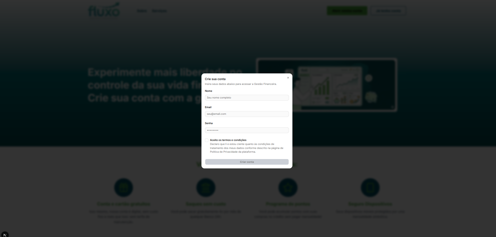
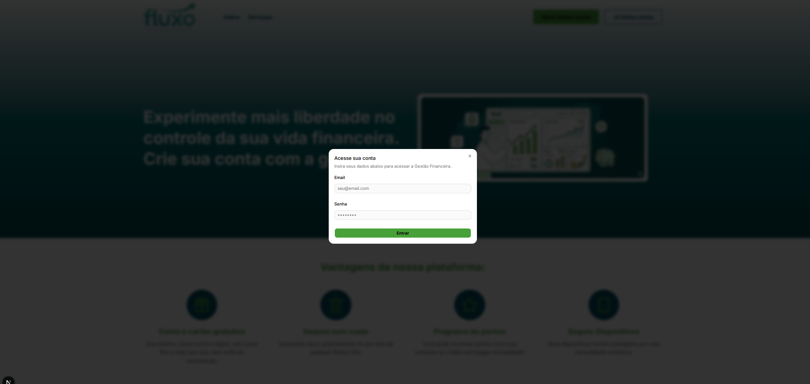

# Fluxo - Gestão Financeira (ByteBank)

Aplicação web para gerenciamento de transações financeiras, permitindo depósitos, transferências e visualização de extrato.

## Sobre o projeto

O Fluxo é uma aplicação desenvolvida com foco em simular operações bancárias básicas no frontend, aplicando conceitos modernos de desenvolvimento como:

- Componentização
- Gerenciamento de estado com hooks
- Persistência de dados no cliente
- Organização escalável de projeto

## Funcionalidades

### Criar transações:
- Depósito
- Transferência
- Atualização automática do saldo

### Visualização de extrato:
- Resumo
- Lista completa de transações
- Persistência de dados com localStorage
- Interface responsiva

## Tecnologias

**Frontend:**
- Next.js
- React
- TypeScript
- Tailwind CSS

**Gerenciamento de estado:**
- React Hooks (useState, custom hooks)

**Persistência de dados:**
- localStorage

**UI Library:**
- shadcn/ui

**Autenticação:**
- Firebase

**Backend simulado:**
- JSON Server (API fake local baseada em arquivo JSON)

## Arquitetura

A aplicação segue o princípio de separação de responsabilidades, dividindo a lógica em camadas bem definidas:

- UI (components) → Interface e reaproveitamento
- Hooks → Regras de negócio (transações, saldo)
- Types → Tipagem centralizada
- Utils/Lib → Funções auxiliares

## Instalação

**Clonar repositório**
```bash
git clone https://github.com/AlanLenz/Tech-Challenge---ByteBank.git
```
**Entrar na pasta**
```bash
cd bytebank
```
**Instalar dependências**
```bash
npm install
```
## Execução

**Rodar API local**
```bash
npx json-server --watch public/data/transactions.json --port 4000
```

**Rodar o projeto**
```bash
npm run dev
```
## Estrutura do projeto

```bash
src/
├── app/                # Rotas (Next.js App Router)
│   ├── extract/        # Página de extrato
│   ├── home/           # Página inicial
│   ├── landingPage/    # Landing page
│   ├── layout.tsx      # Layout global
│   ├── page.tsx        # Página principal
│   └── globals.css     # Estilos globais
│
├── components/         # Componentes reutilizáveis
│   ├── ExtractPreview
│   ├── FeedbackModal
│   ├── Footer
│   ├── forms/
│   ├── Header
│   ├── Hero
│   ├── MenuItem
│   ├── MobileMenu
│   ├── SideMenu
│   ├── Snippets
│   ├── TransactionForm
│   ├── TransferList
│   └── ui/             # Design system
│
├── hooks/              # Hooks customizados
├── lib/                # Configurações e helpers
├── types/              # Tipagens TypeScript
└── utils/              # Funções auxiliares
```
## Capturas

**Landing Page**


**Home**


**Extrato**


**Cadastro**


**Acessar**



## Autores

- [@AlanLenz](https://github.com/AlanLenz)
- [@amandaSribeiro](https://github.com/amandaSribeiro)
- [@victorgodoi](https://github.com/victorgodoi)


## Licença

Projeto desenvolvido para fins educacionais.
