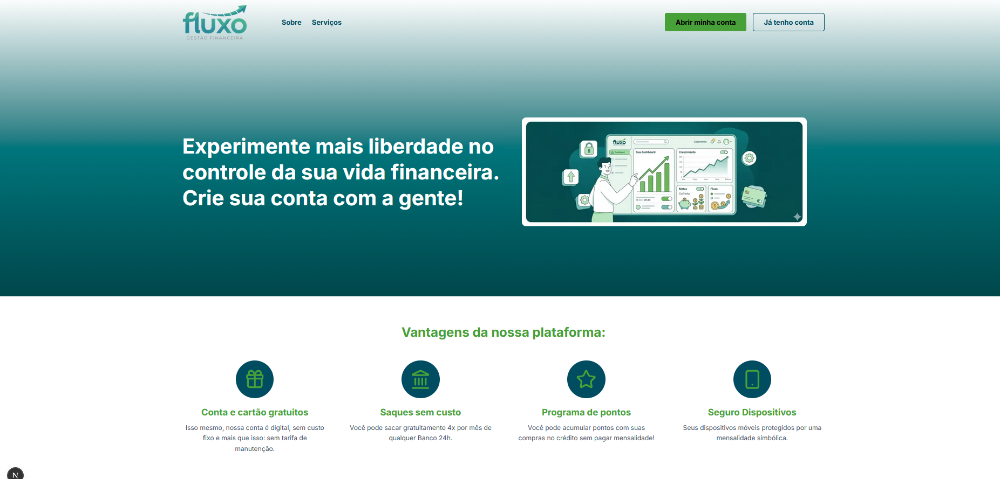
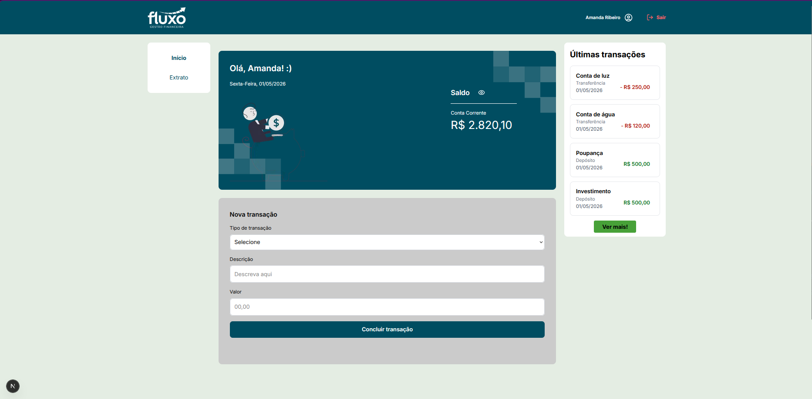
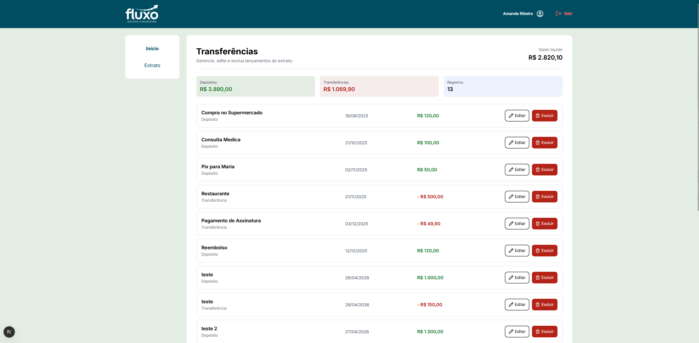
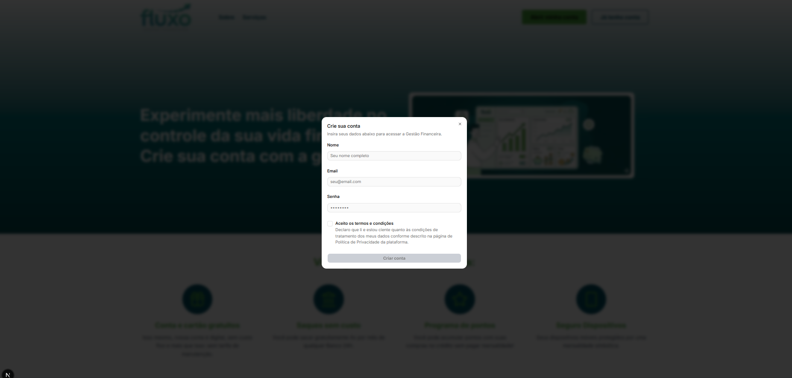
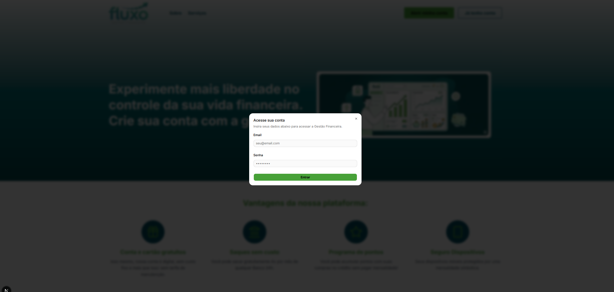

# Fluxo - Gestão Financeira | ByteBank

Aplicação web para gerenciamento de transações financeiras, permitindo depósitos, transferências, visualização de extrato e acompanhamento da movimentação financeira através de dashboard.

## Sobre o projeto

O Fluxo é uma aplicação desenvolvida para simular operações bancárias básicas, aplicando conceitos modernos de desenvolvimento frontend e arquitetura escalável.

O projeto tem como objetivo proporcionar uma experiência completa de gestão financeira, permitindo que usuários realizem movimentações, acompanhem seus dados financeiros e visualizem indicadores através de uma interface moderna e responsiva.

Principais conceitos aplicados:

- Componentização
- Gerenciamento de estado
- Integração com banco de dados
- Organização escalável de projeto
- Separação de responsabilidades
- Design System
- Arquitetura baseada em Microfrontends

---

# Funcionalidades

## Autenticação

- Cadastro de usuários
- Login de usuários
- Controle de acesso às funcionalidades da aplicação
- Gerenciamento de sessão utilizando Firebase Authentication

## Gestão de transações financeiras

- Criação de novas transações
- Realização de depósitos
- Realização de transferências
- Atualização do saldo do usuário
- Validação dos dados informados nos formulários
- Registro das movimentações financeiras no banco de dados

## Extrato financeiro

- Consulta do histórico completo de transações
- Visualização detalhada das movimentações financeiras
- Organização das transações por data e tipo
- Consulta das operações realizadas pelo usuário

## Dashboard financeiro

- Visualização do resumo financeiro
- Análise de entradas e saídas
- Gráfico comparativo de receitas e despesas
- Gráfico de gastos por categoria
- Indicadores para acompanhamento da movimentação financeira

## Categorias financeiras

- Classificação das despesas por categoria
- Associação de categorias às transações
- Visualização dos gastos agrupados para análise financeira

## Interface e experiência do usuário

- Componentes reutilizáveis seguindo princípios de Design System
- Interface responsiva para diferentes dispositivos
- Feedback visual para ações realizadas pelo usuário
- Documentação dos componentes utilizando Storybook

---

# Tecnologias

## Frontend

- Next.js
- React
- TypeScript
- Tailwind CSS

## Banco de dados

- PostgreSQL

## Autenticação

- Firebase Authentication

## UI Library

- shadcn/ui

## Gerenciamento de estado

- React Hooks
- Store global da aplicação

## Persistência de dados

- Dados financeiros armazenados em banco de dados PostgreSQL
- Comunicação com banco através da camada de serviços da aplicação

---

# Arquitetura

A aplicação foi estruturada seguindo princípios de separação de responsabilidades, componentização e escalabilidade.

Organização das principais camadas:

- **App Router** → gerenciamento de páginas e rotas utilizando Next.js

- **Components** → componentes reutilizáveis da aplicação e implementação do Design System

- **Hooks** → regras de negócio reutilizáveis e controle de estados específicos

- **Services** → comunicação com APIs e camada responsável pelo acesso aos dados

- **Store** → gerenciamento de estado global da aplicação

- **Providers** → gerenciamento de contextos compartilhados

- **Types** → centralização das tipagens TypeScript

- **Utils** → funções auxiliares reutilizáveis

- **Lib** → configurações e integrações externas como Firebase e helpers

- **Database** → armazenamento persistente das informações financeiras utilizando PostgreSQL

---

# Microfrontends

O projeto possui uma estrutura preparada para utilização de Microfrontends, permitindo maior escalabilidade, organização e evolução independente dos módulos.

Estrutura:

- **mfe-dashboard**
  - Responsável pela visualização dos dados financeiros, indicadores e gráficos.

- **mfe-transactions**
  - Responsável pelo gerenciamento das transações financeiras.

- **shared**
  - Compartilhamento de componentes, tipos e recursos utilizados entre os módulos.

---

# Storybook

Documentação dos componentes isolados da aplicação utilizando Storybook.

Link de acesso:

https://mfe-dashboard-storybook.vercel.app/

O Storybook foi publicado utilizando Vercel para disponibilização online dos componentes desenvolvidos.

---

# Instalação

## Clonar repositório

```bash
git clone https://github.com/AlanLenz/Tech-Challenge---ByteBank.git
```
## Executando com Docker

### Pré-requisitos

- Docker Desktop
- Docker Compose

### Construir as imagens

```bash
docker-compose build
```

### Iniciar os containers

```bash
docker-compose up
```

Ou em segundo plano:

```bash
docker-compose up -d
```

### Encerrar a aplicação

```bash
docker-compose down
```
---
# Estrutura do projeto

```text
Tech-Challenge---ByteBank/

├── bytebank/
│   └── .next/                         # Build do Next.js
│
├── .storybook/                        # Configuração do Storybook
│
├── public/                            # Arquivos estáticos
│
├── src/
│   ├── app/                           # App Router do Next.js
│   ├── components/                    # Componentes reutilizáveis
│   ├── hooks/                         # Hooks customizados
│   ├── lib/                           # Configurações e integrações
│   ├── providers/                     # Providers da aplicação
│   ├── services/                      # Comunicação com dados
│   ├── store/                         # Estado global
│   ├── styles/                        # Estilos globais
│   ├── types/                         # Tipagens TypeScript
│   └── utils/                         # Funções auxiliares
│
├── mfe-dashboard/                     # Microfrontend dashboard
│
├── mfe-transactions/                  # Microfrontend transações
│
├── shared/                            # Recursos compartilhados
│
├── Dockerfile                         # Configuração do container
├── docker-compose.yml                 # Orquestração dos serviços
├── package.json
├── tsconfig.json
├── tailwind.config.ts
├── next.config.mjs
└── README.md
```

---

# Capturas

## Landing Page



## Home



## Extrato



## Cadastro



## Acessar



---

# Autores

- [@AlanLenz](https://github.com/AlanLenz)
- [@amandaSribeiro](https://github.com/amandaSribeiro)
- [@victorgodoi](https://github.com/victorgodoi)

---

# Licença

Projeto desenvolvido para fins educacionais.
